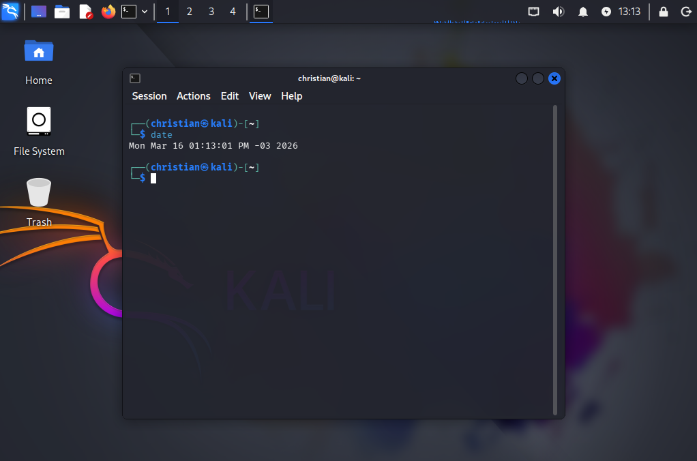
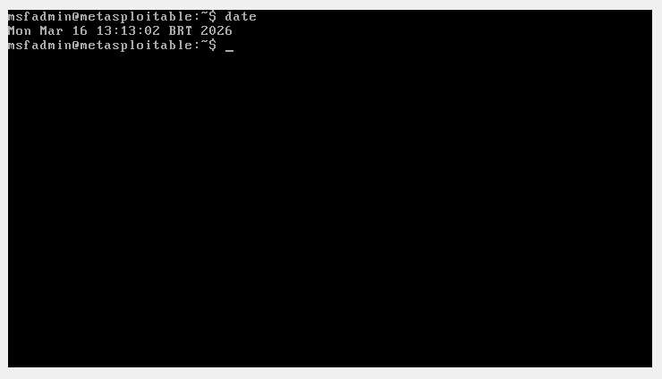
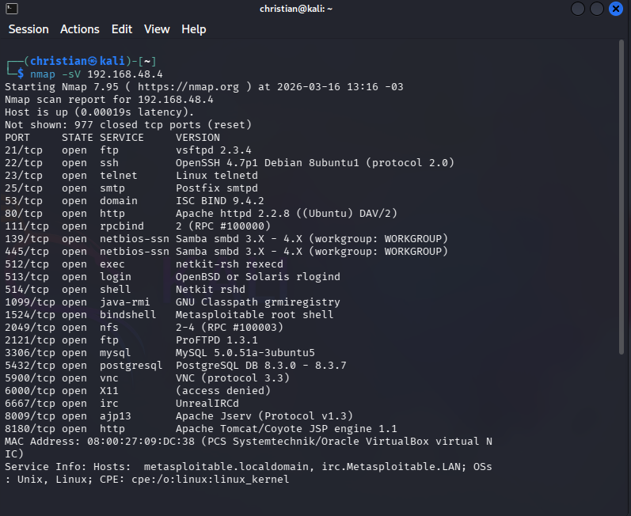
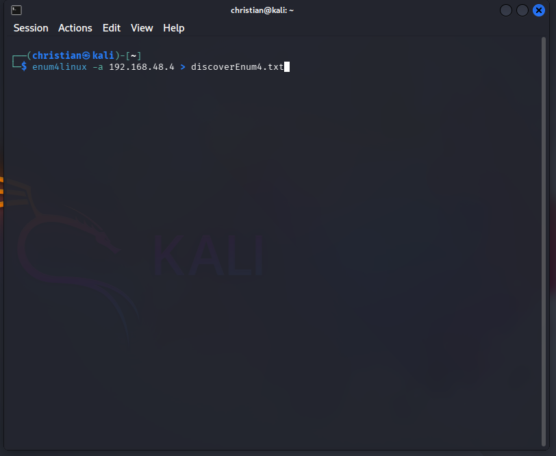
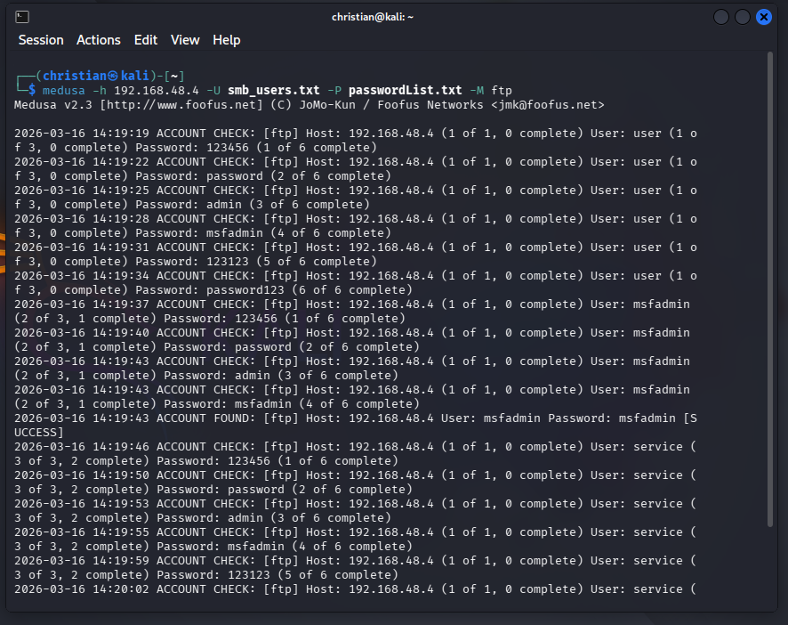
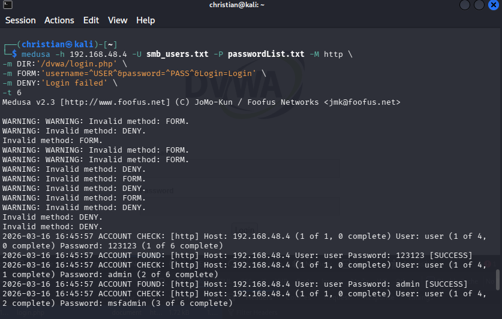

🔐 Simulando um Ataque de Brute Force de Senhas com Medusa e Kali Linux

📚 Curso: DIO Riachuelo — Cibersegurança

📌 Desafio

Simular ataques de força bruta em um ambiente controlado utilizando ferramentas de segurança ofensiva com o objetivo de compreender vulnerabilidades comuns em sistemas de autenticação.
O laboratório utiliza o Kali Linux como máquina atacante e ambientes vulneráveis como Metasploitable 2 e DVWA, com a ferramenta Medusa para automatizar tentativas de autenticação.

🧠 Descrição do Desafio

Neste desafio foi proposto implementar, documentar e compartilhar um laboratório prático de ataques de força bruta em um ambiente isolado.
O objetivo é explorar conceitos fundamentais de segurança ofensiva, demonstrando como ataques podem ser realizados e como medidas de proteção podem ser aplicadas para mitigá-los.

O laboratório consiste em:
- Configuração de máquinas virtuais
- Simulação de ataques de autenticação
- Enumeração de usuários
- Execução de ataques automatizados
- Documentação do processo

🎯 Objetivos de Aprendizagem

Ao concluir este desafio, é possível desenvolver as seguintes habilidades:

- Compreender ataques de força bruta em serviços FTP, Web e SMB
- Utilizar o Kali Linux para testes de segurança
- Automatizar ataques de autenticação com Medusa
- Identificar vulnerabilidades em sistemas
- Documentar testes de segurança
- Utilizar o GitHub como portfólio técnico

🖥️ Ambiente do Laboratório

Ambiente do Laboratório
O ambiente foi configurado utilizando máquinas virtuais no VirtualBox.
As máquinas foram configuradas utilizando Host-Only Network no VirtualBox para permitir comunicação entre as VMs.

Máquina atacante
Sistema operacional:
Kali Linux

Ferramentas utilizadas:
- Medusa
- enum4linux
- FTP client
- Navegador web

Máquina vulnerável
Sistema operacional:
Metasploitable 2

Serviços explorados:
- FTP
- SMB
- DVWA (Damn Vulnerable Web Application)

🔎 Descoberta de Serviços com Nmap

Antes de iniciar a enumeração e os ataques de força bruta, foi realizada uma etapa de reconhecimento do alvo utilizando o Nmap.

O objetivo dessa varredura é identificar:

- portas abertas
- serviços ativos
- possíveis vetores de ataque

Ferramenta utilizada:
- Nmap

Comando utilizado:
`nmap -sV 192.168.48.4`

🔎 Enumeração de Usuários com enum4linux

Antes de realizar ataques de força bruta, foi feita uma etapa de enumeração de usuários utilizando a ferramenta enum4linux.

Comando utilizado:
`enum4linux -a 192.168.48.4 > discoverEnum4.txt`

Essa ferramenta permite identificar:

- usuários do sistema
- compartilhamentos SMB
- informações do sistema
- Cria um arquivo de texto(discoverEnum4.txt) com as informações identificadas.

🔑 Criação da Wordlist de Usuário

A lista de usuários foi baseada nas informações obtidas durante a fase de enumeração com enum4linux.
- [Lista de usuários](wordlists/smb_users.txt)

Para organizar os usuários identificados, foi criado um arquivo chamado smb_users.txt contendo os possíveis usuários do sistema.
Esse arquivo será utilizado posteriormente pela ferramenta Medusa para testar autenticação nos serviços disponíveis.

Exemplo de conteúdo do arquivo:

- msfadmin
- user
- postgres
- service
- root

🔑 Criação da Wordlist de Senhas

Também foi criada uma wordlist simples contendo senhas comuns, frequentemente utilizadas em ataques de força bruta para testar sistemas com configurações fracas de segurança.
- [Lista de senhas](wordlists/passwordsList.txt)

Exemplo do arquivo passwordList.txt:

- 123456
- password
- admin
- admin123
- root
- toor
- 12345678
- qwerty

Essas senhas representam combinações frequentemente encontradas em vazamentos de dados ou utilizadas por usuários com práticas de segurança inadequadas.

👊 Ataque de Força Bruta em FTP

Após identificar possíveis usuários, foi realizado um ataque de força bruta no serviço FTP.

Ferramenta utilizada:
- Medusa

Comando utilizado:
`medusa -h 192.168.48.4 -U smb_users.txt -P passwordList.txt -M ftp`

👊 Ataque de Força Bruta em HTTP

Comandos utilizado:
- `medusa -h 192.168.48.4 -U smb_users.txt -P passwordList.txt -M http \`
- `-m DIR:/dvwa/login.php \`
- `-m FORM:"username=^USER^&password=^PASS^&Login=Login" \`
- `-m DENY:"Login failed" \`
- `-t 6`

🛡️ Medidas de Mitigação

Os testes demonstram como serviços vulneráveis podem ser explorados quando não existem controles adequados de segurança.

Boas práticas incluem:

Autenticação
- Uso de senhas fortes
- Políticas de complexidade de senha
- Bloqueio de conta após múltiplas tentativas

Aplicações Web
- Implementação de CAPTCHA
- Rate limiting
- Monitoramento de tentativas de login

Serviços de Rede
- Desativar serviços desnecessários
- Monitoramento de logs
- Restrição de acesso por firewall

📚 Conclusão

Este laboratório permitiu compreender na prática como ataques de força bruta podem comprometer serviços vulneráveis quando não existem mecanismos adequados de proteção.

Além da execução dos testes, a documentação do processo contribui para consolidar o aprendizado e criar um portfólio técnico demonstrando conhecimentos iniciais em segurança ofensiva e pentest.

⚠️ Aviso

Este projeto foi desenvolvido exclusivamente para fins educacionais em ambiente controlado.

A realização de testes de segurança sem autorização pode ser considerada atividade ilegal.

